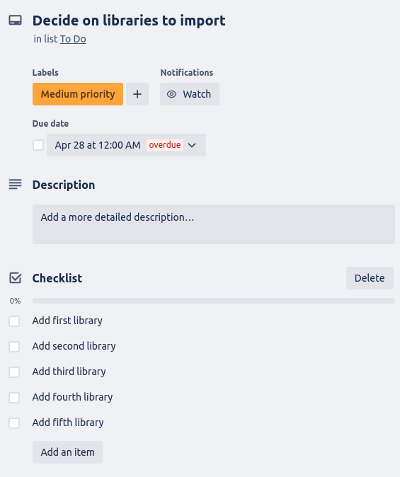

# T1A3 - Terminal Application

## Source Control Repository: https://github.com/zakaryjs/T1A3-Terminal_Application

## Style guide: My program followed the Pep-8 Style Guide.
## https://peps.python.org/pep-0008/

## Features

1. Main Menu
Acts as the main interface for the application, presenting the user with a variety of options for what tasks can be completed with the application. These features include creating events, modifying events, viewing events and receiving an output depending on how many events are in a certain month.

2. Add Activity to Date
This applications main feature is the ability to add activities to specific days, like you would on a normal calendar. Multiple activities can be stored inside of one date, and the same activity can be stored inside of multiple different days.

3. Delete Activity from Date
This application also provides the user with the ability to remove activities from specific days, again, like you would on a normal calendar. Removal can happen at any point in time, and results in permanent event deletion from the calendar.

4. View Activities from a Month
This application provides the user with the ability to print all saved dates within a certain month. The dates and activities will be printed in a list format, to make sure that they are easy to view.

5. Month Output
This application also provides the user with the ability to request an output (one of three) that will determine how busy a users month is. The three available outputs are "This is a quiet month", "This is a relatively busy month", "This is a really busy month!".

6. Get Date
This application provides the user with the ability to request the current date. This uses the datetime module.

File will be output in CSV format after modifications have been made.

### How each Feature will be Implemented

1. Main Menu
Will be implemented with a main_menu function, printing all available features along with their associated inputs required for operation. This will be located in ```calendar_functions.py```. 

2. Add Activity to Date
Will be implemented with an add_calendar function, allowing the user to input a date (month and day) as well as an activity name - with additional details if needed. This function will be located in ```calendar_functions.py```.

3. Delete Activity from Date
Will be implemented with a delete_calendar function, allowing the user to input a date, view all of the activities associated with that date, and then delete a certain activity. This function will be located in ```calendar_functions.py```. 

4. View Activities from a Month
Will be implemented with a view_calendar function, allowing the user to input a month, and view all of the activities in said month. This function will be located in ```calendar_functions.py``.

5. Month Output 
Will be implemented with a ```measure_calendar``` function, used in conjunction with the view_calendar function. This will provide an output depending on how many activities are stored in a certain month. The three available outputs are "This is a quiet month", "This is a relatively busy month", "This is a really busy month!".

6. Get Date
Will be implemented with a ```get_date``` function. Will provide the user with the current date.

## Implementation Plan


### Checklists





## Help Documentation

### To Download and Activate

1. Download the zip or clone from the source repository.
2. Ensure that Python is installed - ```python3 -- version``` in the terminal. If not, [Download Python](https://www.python.org/downloads/).
3. Run the ```run.sh``` file, by right clicking and selecting ```run as program```.

### Modules Used

Calendar
<br>
Datetime
<br>
Colored
<br>
Emoji
<br>
Pytest
<br>
calendar_functions
<br>

### System and Hardware Requirements

1. Have Python installed
2. Have a terminal
<br>
This program is not intensive, and should run on every modern PC.

### How to Use

Either:

1. Download the files, navigate to ```src/```.
2. Right click on ```run.sh``` and select ```Run as Program```.
3. Follow the on screen instructions to enjoy the program.

Or:

1. Download the files, open the terminal and navigate to ```src/```.
2. If the venv is created, simply type ```python3 main.py```.
3. If not, type the following:
<br>
```python3 -m venv calendar-venv```
<br>
```source calendar-venv/bin/activate```
<br>
```pip install -r requirements.txt```
<br>
```clear```
<br>
```python3 main.py```